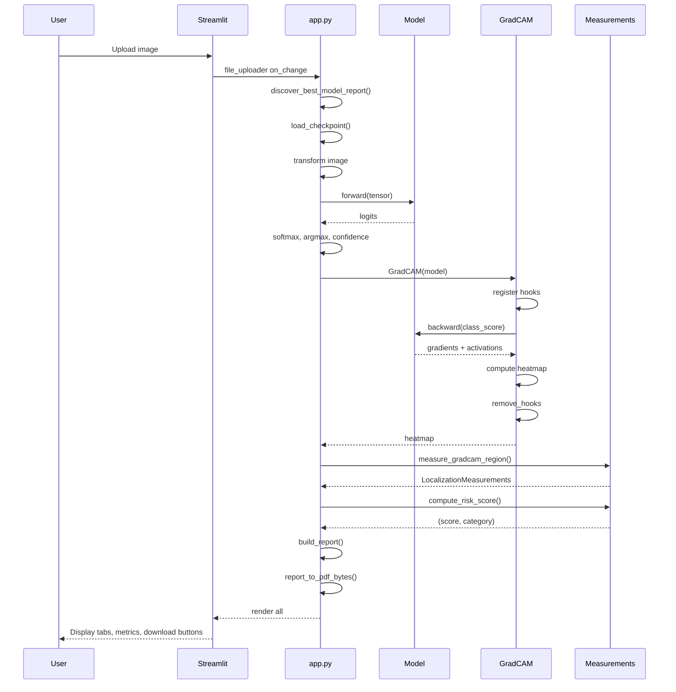

# PROJECT_CONTEXT.md — Lung Cancer Detection

This document is intended for AI agents and human developers taking ownership of this codebase. It captures the complete mental model, architecture decisions, known state, and development trajectory.

---

## 1. Product Vision

### Mission
Build a research-grade end-to-end medical image processing and deep learning system for lung cancer detection using the IQ-OTH/NCCD CT slice dataset. The system is a prototype clinical decision support system (CDSS) suitable for academic demonstration and future research extensions.

### Goals (from plan.md)
1. Lung cancer classification (benign / malignant / normal)
2. Tumor localization (bounding box via weak supervision)
3. Tumor segmentation (planned — not implemented)
4. Tumor measurement extraction (area, diameter, location)
5. Malignancy probability estimation (risk score 0–100)
6. Explainable AI visualization (Grad-CAM heatmaps)
7. Clinical report generation (JSON + PDF)
8. Research-grade evaluation and experimentation

### Non-Goals (explicit)
- Not a clinical diagnostic tool
- Not FDA/HIPAA compliant
- Not a replacement for radiologist review
- Not designed for multi-user or production deployment

---

## 2. Current Status Snapshot

| Dimension | Value |
|---|---|
| Best model | EfficientNet-B0 (pretrained) |
| Best accuracy | 97.59% |
| Best weighted F1 | 97.59% |
| Best ROC-AUC (weighted OvR) | 99.63% |
| Training epochs | 8 |
| Dataset size | 1097 JPG images (120 benign, 561 malignant, 416 normal) |
| Device | CUDA GPU (RTX 5070 12GB) |
| Framework | PyTorch 2.7+, TorchVision 0.22+ |
| Dashboard | Streamlit 1.46+ |
| Development stage | Late-stage research prototype |
| Version control | None (not a git repository) |

---

## 3. Architecture

### 3.1 High-Level Architecture

The system is a flat Python project with a modular package structure. There are two independent entry points: a training CLI (`train.py`) and an inference dashboard (`app.py`). There is no web server, database, message queue, or containerization.

```
User Input (CLI args / HTTP upload)
        │
        ▼
┌─────────────────────────────────────────────────────────┐
│                   TRAINING PIPELINE                      │
│                                                         │
│  dataset/ → analyzer.py → SplitRecords → DataLoader     │
│              ↓                                           │
│         transforms.py (CLAHE, augment)                   │
│              ↓                                           │
│         classification.py (backbone + head)              │
│              ↓                                           │
│         train.py (AMP, early stopping, checkpointing)     │
│              ↓                                           │
│         metrics.py → reports/ (JSON, CSV, PDF)           │
│              ↓                                           │
│         gradcam.py → explainability/ (PNG overlays)      │
└─────────────────────────────────────────────────────────┘

┌─────────────────────────────────────────────────────────┐
│                  INFERENCE DASHBOARD                      │
│                                                         │
│  app.py (Streamlit)                                      │
│    ├── discover_best_model_report() — scans outputs/     │
│    ├── load_checkpoint() — loads .pt with metadata       │
│    ├── GradCAM.generate() — produces heatmap             │
│    ├── measure_gradcam_region() — bbox, area, diameter   │
│    ├── compute_risk_score() — 0–100 + category           │
│    ├── build_report() — structured JSON                  │
│    └── report_to_pdf_bytes() — PDF download              │
└─────────────────────────────────────────────────────────┘
```

### 3.2 Layer Responsibilities

| Layer | Module | Responsibility |
|---|---|---|
| Dataset | `data/analyzer.py` | Inspect folder structure, verify images, extract metadata, detect case IDs |
| Dataset | `data/dataset.py` | Stratified splitting (slice/group), weighted sampling, DataLoader creation |
| Preprocessing | `preprocessing/transforms.py` | CLAHE enhancement, denoising, normalization, augmentation pipeline |
| Preprocessing | `preprocessing/visualization.py` | Side-by-side before/after preview image generation |
| Models | `models/classification.py` | 6 TorchVision backbones with replaced classifier heads |
| Training | `train.py` | Orchestrator: parse args, run epochs, checkpoint, evaluate, explain |
| Evaluation | `evaluation/metrics.py` | Accuracy, precision, recall, F1, ROC-AUC, confusion matrix, ROC curves |
| Explainability | `explainability/gradcam.py` | Grad-CAM heatmap generation, artifact batch creation |
| Explainability | `explainability/integrated_gradients.py` | Integrated Gradients (implemented but unused) |
| Measurements | `measurements/gradcam_measurements.py` | Bounding box extraction, area/diameter, location labeling, risk scoring |
| Reporting | `reports/reporting.py` | CSV/JSON benchmark reports, clinical summary PDF |
| Dashboard | `app.py` | Streamlit UI, inference orchestration, report downloads |
| Scripts | `scripts/finalize_best_model.py` | Post-hoc artifact regeneration for completed runs |
| Config | `config.py` | TrainingConfig dataclass, default class names |

### 3.3 Data Flow (Training)

```
dataset/*.jpg
  → data/analyzer.py: analyze_dataset()
      → PIL verify → resolution/mode extraction → class counting
      → case ID inference (folder structure or regex)
      → writes dataset_analysis.json + dataset_summary.csv
  → data/dataset.py: create_split_records()
      → stratified train (70%) / val (15%) / test (15%)
      → auto-detects slice vs group split mode
      → writes split_audit.json
  → data/dataset.py: create_dataloaders()
      → WeightedRandomSampler (class-balanced)
      → LungCancerDataset with train or eval transforms
  → preprocessing/transforms.py: build_train_transforms()
      → MedicalPreprocess (CLAHE → denoise → normalize → sharpen)
      → Resize(224) → Rotate(20°) → HFlip/VFlip → BrightnessContrast
      → Affine (translate, scale) → ElasticTransform
      → Normalize(ImageNet) → ToTensor()
  → preprocessing/transforms.py: build_eval_transforms()
      → MedicalPreprocess → Resize(224) → Normalize → ToTensor()
  → models/classification.py: create_model()
      → TorchVision backbone (weights=None or pretrained)
      → _disable_inplace_relu (required for Grad-CAM backward hooks)
      → _replace_head (new classifier for num_classes=3)
  → train.py: train_single_model()
      → AdamW optimizer, CrossEntropyLoss (weighted)
      → AMP GradScaler for CUDA
      → per-epoch: run_epoch(train=True) + evaluate()
      → checkpoint on best val F1, patience-based early stopping
  → evaluation/metrics.py: compute_metrics()
      → accuracy, precision_weighted, recall_weighted, f1_weighted
      → roc_auc_ovr_weighted (OvR, weighted average)
  → train.py: save_history()
      → train/val loss + F1 curves as PNG
  → evaluation/metrics.py: save_confusion_matrix(), save_roc_curve()
      → PNG files per model
  → reports/reporting.py: save_benchmark_report()
      → CSV + JSON leaderboard sorted by weighted F1
  → reports/reporting.py: save_clinical_summary_pdf()
      → PDF with best model info
  → explainability/gradcam.py: create_explainability_artifacts()
      → 6 Grad-CAM overlays from test set
```

### 3.4 Data Flow (Inference / Dashboard)

```
User uploads JPG/PNG via Streamlit file_uploader
  → app.py: Image.open() → convert("RGB") → np.array()
  → preprocessing/transforms.py: build_eval_transforms()(image=image_np)
      → MedicalPreprocess → Resize(224) → Normalize → ToTensor()
  → model.forward() → logits
  → F.softmax(logits) → probabilities
  → argmax → predicted_class, confidence
  → app.py: GradCAM(model).generate(tensor, class_index)
      → register_forward_hook + register_full_backward_hook
      → backward on class score → pooled gradients × activations
      → ReLU → resize → normalize → heatmap
      → remove_hooks()
  → measurements/gradcam_measurements.py: measure_gradcam_region()
      → threshold (max(0.55, 88th percentile))
      → morphological open/close
      → largest contour → bounding rect → area, diameter, center
      → _location_from_center() → "Upper Right Lung Region" etc.
  → measurements/gradcam_measurements.py: compute_risk_score()
      → weighted combination of malignant/benign prob + activation fraction
      → 0–100 integer, "Low" (<35), "Moderate" (35-69), "High" (70+)
  → measurements/gradcam_measurements.py: make_overlay_and_bbox()
      → heatmap → COLORMAP_JET → weighted overlay
      → draw rectangle + center circle
  → app.py: build_report()
      → structured dict with prediction, confidence, measurements, risk, limitations
  → app.py: report_to_pdf_bytes()
      → ReportLab canvas → A4 PDF with fields
  → Streamlit renders: tabs (original/heatmap/mask), metrics, table, download buttons
```

### 3.5 Request Flow (Dashboard Cycle)



---

## 4. Folder Structure

```
lung-cancer-detection/
│
├── app.py                           # Streamlit dashboard (346 lines)
├── train.py                         # Training CLI (387 lines)
├── config.py                        # Dataclass: TrainingConfig, DEFAULT_CLASS_NAMES
├── requirements.txt                 # 11 pinned dependencies
├── plan.md                          # Original 10-phase project plan
├── README.md                        # Project documentation
├── PROJECT_CONTEXT.md               # THIS FILE
│
├── dataset/                         # IQ-OTH/NCCD lung CT dataset
│   ├── Bengin cases/                # 120 JPGs (note: "Bengin" is a typo)
│   ├── Malignant cases/             # 561 JPGs
│   ├── Normal cases/                # 416 JPGs
│   └── IQ-OTH_NCCD lung cancer dataset.txt  # Dataset description (1 page)
│
├── data/                            # Dataset loading and analysis
│   ├── __init__.py                  # Public exports
│   ├── analyzer.py                  # Dataset inspection, metadata, corruption
│   └── dataset.py                   # Dataset class, splits, loaders, sampling
│
├── preprocessing/                   # Image preprocessing
│   ├── __init__.py
│   ├── transforms.py                # CLAHE, denoising, augmentation, normalization
│   └── visualization.py             # Before/after preview
│
├── models/                          # Model architectures
│   ├── __init__.py
│   └── classification.py            # 6 backbones + head replacement
│
├── evaluation/                      # Metrics and visualization
│   ├── __init__.py
│   └── metrics.py                   # Compute + save metrics, confusion matrix, ROC
│
├── explainability/                  # XAI methods
│   ├── __init__.py
│   ├── gradcam.py                   # Grad-CAM implementation + artifact generation
│   └── integrated_gradients.py      # Integrated Gradients (implemented, unused)
│
├── measurements/                    # Grad-CAM-based tumor measurements
│   ├── __init__.py
│   └── gradcam_measurements.py      # Localization, bbox, area, diameter, risk score
│
├── reports/                         # Report generation
│   ├── __init__.py
│   └── reporting.py                 # Benchmark CSV/JSON, clinical summary PDF
│
├── scripts/                         # Utility scripts
│   └── finalize_best_model.py       # Post-hoc artifact regeneration
│
├── api/                             # PLACEHOLDER — reserved for REST API
│   └── __init__.py
│
├── ui/                              # PLACEHOLDER — reserved (Streamlit lives in app.py)
│   └── __init__.py
│
├── experiments/                     # PLACEHOLDER — reserved for Optuna/MLflow
│   └── __init__.py
│
└── outputs/                         # All training artifacts (auto-created)
    ├── smoke_test/                  # Initial smoke test
    ├── pretrained_smoke/            # Pretrained quick test
    ├── scratch_effb0_4ep/           # EfficientNet-B0 from scratch
    ├── baseline_benchmark_4ep/      # Baseline benchmark (scratch, 4 epochs)
    ├── baseline_pretrained_8ep/     # BEST RUN — pretrained, 8 epochs
    │   ├── analysis/               # dataset_analysis.json, split_audit.json
    │   ├── checkpoints/            # efficientnet_b0_best.pt + densenet121/resnet50 checkpoints
    │   ├── metrics/                # per-model: metrics.json, history.png, cm.png, roc.png
    │   ├── explainability/         # per-model: 6 Grad-CAM PNGs
    │   ├── reports/                # best_model.json, benchmark_results.json/csv, best_model_summary.pdf
    │   └── run_metadata.json       # Config, split sizes, device
    ├── split_audit_smoke/          # Split validation test
    ├── .torch/hub/checkpoints/     # Cached pretrained weights
    └── .matplotlib/                # Matplotlib font cache
```

---

## 5. Features (Complete Inventory)

### 5.1 Training Pipeline
| Feature | File(s) | Status | Notes |
|---|---|---|---|
| CLI argument parsing | `train.py:45-61` | Complete | argparse with 12 parameters |
| Dataset analysis | `data/analyzer.py:60-162` | Complete | Class counts, resolution stats, corruption check, case detection |
| Stratified train/val/test split | `data/dataset.py:134-150` | Complete | 70/15/15, stratified by class |
| Group-aware split | `data/dataset.py:153-174` | Complete | Patient-level via GroupShuffleSplit (dataset doesn't support it) |
| Auto split mode detection | `data/dataset.py:186-209` | Complete | Falls back to slice split when no case IDs |
| Split audit reporting | `data/dataset.py:70-132` | Complete | Documents leakage risks |
| Class-balanced sampling | `data/dataset.py:248-257` | Complete | WeightedRandomSampler + weighted CrossEntropyLoss |
| Image enhancement (CLAHE) | `preprocessing/transforms.py:9-25` | Complete | CLAHE → denoise → normalize → sharpen |
| Training augmentation pipeline | `preprocessing/transforms.py:33-53` | Complete | Rotation, flips, brightness, affine, elastic |
| Multi-backbone training | `models/classification.py:9-15` | Complete (3/6 tested) | 6 architectures defined; ResNet50, EfficientNet-B0, DenseNet121 tested |
| Pretrained transfer learning | `models/classification.py:36-43` | Complete | TorchVision DEFAULT weights |
| Mixed-precision training (AMP) | `train.py:120-127` | Complete | torch.amp.GradScaler + autocast |
| Early stopping | `train.py:229-233` | Complete | Patience-based (default 3) |
| Metric computation | `evaluation/metrics.py:36-62` | Complete | Accuracy, precision, recall, F1, ROC-AUC |
| Confusion matrix PNG | `evaluation/metrics.py:65-80` | Complete | Per-model |
| ROC curve PNG | `evaluation/metrics.py:83-103` | Complete | One-vs-Rest per class |
| Training history plot | `train.py:77-91` | Complete | Loss + F1 curves |
| Benchmark report (JSON+CSV) | `reports/reporting.py:11-33` | Complete | Sorted by F1 |
| Clinical summary PDF | `reports/reporting.py:36-55` | Complete | ReportLab A4 |
| Checkpointing | `train.py:220-228` | Complete | Best val F1 checkpoint |
| Best model auto-selection | `train.py:339-340` | Complete | Highest weighted F1 |
| Explainability artifacts | `explainability/gradcam.py:71-115` | Complete | 6 Grad-CAM overlays per run |
| Preprocessing preview | `preprocessing/visualization.py:14-39` | Complete | Side-by-side original/enhanced |

### 5.2 Inference / Dashboard
| Feature | File(s) | Status | Notes |
|---|---|---|---|
| Best model auto-discovery | `app.py:26-45` | Complete | Scans `outputs/**/best_model.json`, picks highest F1 |
| Checkpoint loading | `app.py:48-55` | Complete | Loads .pt with model_name, state_dict, class_names |
| Image classification | `app.py:224-234` | Complete | Softmax → argmax → class + confidence |
| Grad-CAM heatmap | `explainability/gradcam.py:45-60` | Complete | Hook-based, one class at a time |
| Weak localization (bbox) | `measurements/gradcam_measurements.py:36-107` | Complete | Thresholded heatmap → contour → bounding rect |
| Tumor measurements | `measurements/gradcam_measurements.py:36-107` | Complete | Area (px), diameter (px), area fraction, location label |
| Physical mm estimation | `measurements/gradcam_measurements.py:89-91` | Partial | Requires pixel_spacing_mm (not available for JPG dataset) |
| Risk scoring | `measurements/gradcam_measurements.py:130-148` | Complete | Heuristic: 0.75×malignant + 0.20×activation + 0.05×benign |
| Clinical report (JSON) | `app.py:103-144` | Complete | Structured dict with all fields |
| Clinical report (PDF) | `app.py:147-191` | Complete | ReportLab-generated |
| Benchmark display | `app.py:327-346` | Complete | DataFrame + metric cards |
| Three-view tabs | `app.py:264-270` | Complete | Original, Heatmap, Pseudo-mask |

### 5.3 Utilities / Scripts
| Feature | File(s) | Status | Notes |
|---|---|---|---|
| Post-training finalization | `scripts/finalize_best_model.py` | Complete | Regenerates artifacts for any completed run |

### 5.4 Planned But Unimplemented
| Feature | plan.md Phase | Current State |
|---|---|---|
| U-Net segmentation | Phase 5 | Not started. No `segmentation/` directory exists |
| Attention U-Net | Phase 5 | Not started |
| U-Net++ | Phase 5 | Not started |
| YOLOv11 localization | Phase 4 | Not started |
| Radiomics (shape, texture, GLCM) | Phase 6 | Not started |
| Monte Carlo Dropout | Phase 7 | Not started |
| Calibrated probability distributions | Phase 7 | Not started |
| Uncertainty estimation | Phase 7 | Not started |
| Hyperparameter tuning (Optuna) | Phase 10 | Placeholder only |
| Experiment tracking (MLflow) | Phase 10 | Placeholder only |
| K-fold cross-validation | Phase 10 | Not started |
| Ablation studies | Phase 10 | Not started |
| REST API (FastAPI/Flask) | n/a | Placeholder only |
| DICOM support | n/a | Not started |
| TNM staging | n/a | Not started |
| Patient-level evaluation | n/a | Framework exists, dataset doesn't permit it |

---

## 6. APIs

### 6.1 Public Module Interfaces

```python
# data/__init__.py
analyze_dataset(dataset_dir, output_dir, group_regex=None) -> dict
create_split_records(dataset_dir, analysis_dir, train_ratio, val_ratio, seed, split_mode='auto', group_regex=None) -> SplitRecords
create_dataloaders(split_records, train_transform, eval_transform, batch_size, num_workers) -> tuple[dict[str, DataLoader], Tensor]
load_records(dataset_dir, analysis_dir, group_regex=None) -> tuple[list[dict], list[str], dict]

# preprocessing/__init__.py
build_train_transforms(image_size) -> A.Compose
build_eval_transforms(image_size) -> A.Compose
enhance_image(image) -> np.ndarray
save_preprocessing_preview(records, output_dir, sample_count=6) -> Path

# models/__init__.py
SUPPORTED_MODELS -> list[str]
create_model(model_name, num_classes, use_pretrained) -> nn.Module

# evaluation/__init__.py
compute_metrics(labels, predictions, probabilities, class_names) -> dict
save_confusion_matrix(labels, predictions, class_names, output_path) -> None
save_roc_curve(labels, probabilities, class_names, output_path) -> None

# explainability/__init__.py
GradCAM(model, target_layer=None) -> instance
create_explainability_artifacts(model, dataloader, device, class_names, output_dir, limit=6) -> None
integrated_gradients(model, inputs, target_index, baseline=None, steps=32) -> Tensor

# measurements/__init__.py
LocalizationMeasurements(dataclass)
compute_risk_score(predicted_class, probabilities, measurements) -> tuple[int, str]
make_overlay_and_bbox(image_rgb, heatmap, measurements) -> np.ndarray
measure_gradcam_region(heatmap, image_shape, threshold=0.55, pixel_spacing_mm=None) -> tuple[LocalizationMeasurements, np.ndarray]

# reports/__init__.py
save_benchmark_report(results, output_dir) -> tuple[Path, Path]
save_clinical_summary_pdf(summary, output_path) -> None
```

### 6.2 CLI Interface (train.py)

```
python train.py \
  --dataset-dir PATH          (default: dataset) \
  --output-dir PATH           (default: outputs/<timestamp>) \
  --epochs INT                (default: 8) \
  --batch-size INT            (default: 16) \
  --image-size INT            (default: 224) \
  --learning-rate FLOAT       (default: 3e-4) \
  --weight-decay FLOAT        (default: 1e-4) \
  --patience INT              (default: 3) \
  --seed INT                  (default: 42) \
  --num-workers INT           (default: 4) \
  --pretrained                (use ImageNet weights, default: False) \
  --models LIST               (default: resnet50 efficientnet_b0 densenet121) \
  --split-mode {auto,slice,group} (default: auto) \
  --group-regex STR           (default: None)
```

### 6.3 CLI Interface (finalize_best_model.py)

```
python scripts/finalize_best_model.py \
  --dataset-dir PATH          (default: dataset) \
  --output-dir PATH           (required) \
  --num-workers INT           (default: 2)
```

### 6.4 Dashboard (Streamlit)

```
streamlit run app.py
# Opens at http://localhost:8501
# No CLI arguments
```

### 6.5 REST API

**Not implemented.** The `api/` module contains only a placeholder docstring. No HTTP endpoints exist.

---

## 7. Database Design

**This project has NO database.** All persistence is filesystem-based:

| "Table" | File Format | Schema (fields) |
|---|---|---|
| `dataset/` | Directory of JPGs | 3 class folders containing images |
| `outputs/<run>/run_metadata.json` | JSON | started_at, device, config, class_names, split_sizes |
| `outputs/<run>/analysis/dataset_analysis.json` | JSON | total_images, class_counts, class_distribution, resolution_stats, imbalance_ratio, corrupted_files, case_grouping, records[] |
| `outputs/<run>/analysis/dataset_summary.csv` | CSV | class_name, count, percentage |
| `outputs/<run>/analysis/split_audit.json` | JSON | requested_split_mode, used_split_mode, warning, split_sizes, class_counts, path_overlap, case_overlap |
| `outputs/<run>/analysis/preprocessing_preview.png` | PNG | 6-row grid: original vs enhanced |
| `outputs/<run>/checkpoints/<model>_best.pt` | PyTorch serialized | model_name, state_dict, class_names, config (all via torch.save) |
| `outputs/<run>/metrics/<model>/metrics.json` | JSON | accuracy, precision_weighted, recall_weighted, f1_weighted, roc_auc_ovr_weighted, classification_report |
| `outputs/<run>/metrics/<model>/history.png` | PNG | 2-panel: Loss + F1 curves |
| `outputs/<run>/metrics/<model>/confusion_matrix.png` | PNG | Square confusion matrix |
| `outputs/<run>/metrics/<model>/roc_curve.png` | PNG | OvR ROC per class |
| `outputs/<run>/explainability/<model>/NN_<name>_gradcam.png` | PNG | 3-panel: original, heatmap, overlay |
| `outputs/<run>/reports/benchmark_results.json` | JSON | Array of model results sorted by F1 |
| `outputs/<run>/reports/benchmark_results.csv` | CSV | Same data in tabular format |
| `outputs/<run>/reports/best_model.json` | JSON | Single best result |
| `outputs/<run>/reports/best_model_summary.pdf` | PDF | ReportLab-generated A4 summary |

There is no migration history, no schema evolution, and no concurrent access pattern.

---

## 8. Configuration

All configuration lives in `config.py`:

```python
@dataclass(slots=True)
class TrainingConfig:
    dataset_dir: Path = Path("dataset")
    output_dir: Path = Path("outputs")
    image_size: int = 224
    batch_size: int = 16
    epochs: int = 8
    learning_rate: float = 3e-4
    weight_decay: float = 1e-4
    patience: int = 3
    seed: int = 42
    num_workers: int = min(8, os.cpu_count() or 1)
    use_pretrained: bool = False
    models: list[str] = field(default_factory=lambda: ["resnet50", "efficientnet_b0", "densenet121"])
    train_ratio: float = 0.7
    val_ratio: float = 0.15
    split_mode: Literal["auto", "slice", "group"] = "auto"
    group_regex: str | None = None

DEFAULT_CLASS_NAMES = ["benign", "malignant", "normal"]
```

**Important:** The `output_dir` in `TrainingConfig` is overwritten inside `main()` — `train.py` does NOT use `config.output_dir` directly but creates a timestamped subdirectory under `outputs/`. The config's `output_dir` default is only used by `scripts/finalize_best_model.py`.

---

## 9. Business Logic Details

### 9.1 Risk Score Formula (`gradcam_measurements.py:130-148`)

```
activation_component = min(area_fraction * 250.0, 1.0) if detected else 0.0

if predicted_class == "normal":
    score = 100 * (0.75 * malignant_prob + 0.15 * benign_prob + 0.10 * activation)
elif predicted_class == "benign":
    score = 100 * (0.45 * benign_prob + 0.35 * malignant_prob + 0.20 * activation)
else:  # malignant
    score = 100 * (0.75 * malignant_prob + 0.20 * activation + 0.05 * benign_prob)

category = "Low" if score < 35 else "Moderate" if score < 70 else "High"
```

This is a **heuristic**, not a calibrated score. It weights classification probabilities and Grad-CAM activation area. It is not clinically validated.

### 9.2 Diagnosis Label Mapping (`app.py:85-90`)

```
malignant → "Lung Cancer Detected"
benign   → "Abnormal Lung Finding Detected (Benign)"
normal   → "Lung Cancer Not Detected"
```

### 9.3 Grad-CAM Target Layer Resolution (`gradcam.py:14-23`)

The `_resolve_target_layer` function uses duck-typing heuristics:
- `model.layer4[-1]` → ResNet-style
- `model.features[-1]` → DenseNet/EfficientNet-style
- `model.blocks[-1]` → ViT/ConvNeXt-style

This may produce incorrect or suboptimal layers for some architectures. Known tested: works correctly for ResNet50, EfficientNet-B0, DenseNet121.

### 9.4 Adaptive Heatmap Threshold (`gradcam_measurements.py:46`)

```python
adaptive_threshold = max(float(threshold), float(np.percentile(resized_heatmap, 88)))
```

Uses the 88th percentile as a floor to adaptively binarize the heatmap. This means the threshold varies per image based on heatmap intensity distribution.

### 9.5 Split Mode Decision Logic (`dataset.py:186-209`)

```
if split_mode == "group":
    if has_grouping:  mode_used = "group"
    else:             mode_used = "slice" + warning
elif split_mode == "auto":
    mode_used = "group" if has_grouping else "slice" + warning
else:  # "slice"
    mode_used = "slice"
```

For the current flat JPG dataset (no subfolders per case), `has_grouping` is always False, so the pipeline always uses slice-level splitting. This means current metrics represent slice-level accuracy, not patient-level.

### 9.6 Grad-CAM Target Class for "normal" Predictions (`app.py:234-235`)

```python
cam_index = prediction_index if predicted_class != "normal" else malignant_index
```

When the model predicts "normal", Grad-CAM is generated for the "malignant" class instead (to show what would have triggered a cancer prediction). This is an intentional design choice for explainability.

---

## 10. Development Roadmap

### Phase 1: Image Preprocessing (COMPLETE)
- CLAHE, denoising, normalization
- Training augmentation pipeline
- Before/after visualization

### Phase 2: Lung Cancer Classification (COMPLETE)
- 6 architectures defined, 3 benchmarked
- Comparative benchmarking with full metrics
- Best model auto-selection

### Phase 3: Explainable AI (PARTIALLY COMPLETE)
- Grad-CAM: complete (training artifacts + dashboard)
- Integrated Gradients: implemented but not wired to pipeline or dashboard

### Phase 4: Tumor Localization (COMPLETE — weak approach)
- Grad-CAM-based bounding boxes (implemented)
- YOLOv11 supervised localization (NOT started)

### Phase 5: Tumor Segmentation (NOT STARTED)
- U-Net, Attention U-Net, U-Net++ planned
- No `segmentation/` module exists
- Requires annotated segmentation masks (not available in current dataset)

### Phase 6: Tumor Measurements (PARTIALLY COMPLETE)
- Area, diameter, location: complete (pixel-based)
- Physical mm: requires DICOM spacing (not available)
- Shape features (circularity, compactness, eccentricity): NOT started
- Texture features (GLCM): NOT started

### Phase 7: Malignancy Probability (COMPLETE — basic heuristic)
- Risk score 0-100: implemented
- Monte Carlo Dropout: NOT started
- Calibrated distributions: NOT started
- Uncertainty estimation: NOT started

### Phase 8: Clinical Report Generator (COMPLETE)
- Structured JSON report
- PDF via ReportLab
- Download buttons in dashboard

### Phase 9: Interactive Dashboard (COMPLETE)
- Streamlit with tabs, metrics, images, downloads
- Benchmark display

### Phase 10: Research Module (NOT STARTED)
- Optuna: placeholder only
- MLflow: placeholder only
- K-fold CV: not implemented
- Ablation studies: not implemented

### Immediate Next Steps (Priority Order)

1. **Initialize version control** — `git init`, add `.gitignore`, create initial commit
2. **Secure checkpoint loading** — Change `weights_only=False` to `weights_only=True` in `app.py:50`, `train.py:235,271`
3. **Wire Integrated Gradients** — Add to dashboard explainability tab
4. **Benchmark advanced models** — Run `efficientnet_v2_s`, `convnext_tiny`, `vit_b_16`
5. **Add unit tests** — For each module (data, preprocessing, models, evaluation, explainability, measurements)
6. **Centralize matplotlib config** — Move `matplotlib.use("Agg")` to single utility
7. **Consolidate checkpoint loading** — Unify duplicate code between `app.py` and `train.py`
8. **Create REST API** — Basic FastAPI inference endpoint
9. **Add DICOM support** — Pixel spacing parsing for physical measurements

---

## 11. Known Issues

### Data Issues
| Issue | Details |
|---|---|
| Dataset folder name typo | `dataset/Bengin cases/` should be "Benign". Corrected at runtime by `normalize_class_name()` |
| Dataset incomplete | Text file states 1190 images / 110 cases; only 1097 JPGs available locally |
| No case IDs in filenames | All images are flat in class folders with opaque filenames; patient-level evaluation impossible |
| No pixel spacing | JPG export strips DICOM metadata; physical (mm) measurements unavailable |
| No segmentation masks | Supervised segmentation training impossible with current data |
| Class imbalance | 120 benign vs 561 malignant vs 416 normal (mitigated by weighted sampling) |

### Code Issues
| Issue | Details |
|---|---|
| No tests | Zero unit, integration, or regression tests |
| No version control | No git history, no branches, no commit messages |
| `weights_only=False` | PyTorch pickle loading is insecure for untrusted `.pt` files |
| No input sanitization | PIL `Image.open()` on user upload is a potential attack vector |
| Hardcoded paths | `Path("outputs")`, `Path("dataset")` scattered through code |
| Matplotlib config scattered | `matplotlib.use("Agg")` repeated in 4 files |
| Dead code | `integrated_gradients.py` never called; 3 model architectures in SUPPORTED_MODELS never tested |
| Duplicate overlay logic | Grad-CAM overlay in `gradcam.py:96-97` vs `measurements.py:117-119` have slightly different alpha weights |
| No logging | Uses `print()` and `write_text()` instead of Python `logging` |
| Config output_dir not actually used | `TrainingConfig.output_dir` default is `Path("outputs")` but training creates a subdirectory; the config default is only used by `finalize_best_model.py` |

### Architectural Issues
| Issue | Details |
|---|---|
| Single process | Training is synchronous and single-threaded; no distributed support |
| No session state | Dashboard recomputes inference every interaction; no caching |
| No database | All data in flat files — no query, no concurrency, no backup strategy |
| No deployment config | No Dockerfile, no docker-compose, no cloud deployment scripts |
| No monitoring | No metrics export, no logging aggregation, no error tracking |
| No environment management | No `.env` file, no secrets management, no environment-specific config |

---

## 12. Technical Debt Register

### Critical
- [TD-001] No security hardening in checkpoint loading (`weights_only=True` fix needed in 3 locations)
- [TD-002] No input validation for uploaded images in Streamlit

### High
- [TD-003] Zero test coverage across entire codebase
- [TD-004] No version control history
- [TD-005] Dead code in `integrated_gradients.py` (exported but never imported by any pipeline)
- [TD-006] Advanced models defined but never benchmarked (wasted architecture)

### Medium
- [TD-007] Duplicate Grad-CAM overlay rendering code (two implementations with different alpha values)
- [TD-008] Matplotlib backend config scattered across 4 files
- [TD-009] No centralized path management (hardcoded `"outputs"`, `"dataset"` strings)
- [TD-010] Print-based logging instead of structured logging
- [TD-011] No `.gitignore` (`.pyc` files, `.venv/`, and logs are tracked)

### Low
- [TD-012] Dataset folder has typo ("Bengin" vs "Benign")
- [TD-013] Config `output_dir` default is misleading (not used as-is by training)
- [TD-014] Placeholder modules (`api/`, `ui/`, `experiments/`) with docstring-only `__init__.py`
- [TD-015] `serialize_for_json()` utility has incomplete type annotations

---

## 13. Important Design Decisions

### Decision 1: Streamlit over FastAPI/React
- **Choice:** Streamlit for the dashboard instead of a REST API + SPA frontend
- **Rationale:** Fastest path to a working UI for a research prototype; no frontend expertise required
- **Trade-off:** Limited customization, no mobile support, no API for external integration
- **Status:** Streamlit module lives in `app.py`; `api/` and `ui/` modules are placeholders for future migration

### Decision 2: Flat JPG Dataset with Slice-Level Evaluation
- **Choice:** Accept the dataset as-is (flat JPGs) rather than requiring DICOM or per-case folders
- **Rationale:** The dataset export is flat; reconstructing case IDs is infeasible
- **Trade-off:** Current evaluation is slice-level, not patient-level. Metrics may overestimate real-world performance since the same patient's slices could span train and test sets
- **Mitigation:** Split audit reporting documents this limitation; group-aware splitting code exists for when case data becomes available

### Decision 3: Grad-CAM as Localization Proxy
- **Choice:** Use Grad-CAM activation maps for weak localization instead of supervised object detection
- **Rationale:** Dataset has no bounding box or segmentation annotations; Grad-CAM requires no extra labels
- **Trade-off:** Grad-CAM boundaries are approximate, not tumor-accurate; measurements are pixel-based not physical
- **Status:** Working well enough for a prototype; YOLOv11 localization is planned as a future enhancement

### Decision 4: Single Pass Over Dataset for Splitting
- **Choice:** Analyze the complete dataset before every training run
- **Rationale:** Simple, no database needed; ensures consistency
- **Trade-off:** Slow startup on large datasets; no incremental analysis; PIL.verify() on every file every time

### Decision 5: No Logging Framework
- **Choice:** Use `print()` and `write_text()` instead of Python's `logging` module
- **Rationale:** Minimal dependency, simpler for a research script
- **Trade-off:** No log levels, no structured output, no log rotation

### Decision 6: `_disable_inplace_relu` on All Models
- **Choice:** Disable in-place ReLU operations globally
- **Rationale:** Grad-CAM hooks require access to activation values; in-place ReLU overwrites them
- **Trade-off:** Slightly higher memory usage; necessary for explainability

### Decision 7: Adaptive Heatmap Threshold
- **Choice:** `max(fixed_threshold, percentile(heatmap, 88))` instead of a fixed threshold
- **Rationale:** Fixed thresholds fail on low-activation images; adaptive threshold ensures reasonable binarization
- **Trade-off:** Different images use different effective thresholds, making comparisons across images unreliable

### Decision 8: Risk Score as Heuristic (Not ML)
- **Choice:** Hand-crafted scoring formula instead of trained risk model
- **Rationale:** No labeled risk data available; heuristic allows immediate use
- **Trade-off:** Not calibrated, not clinically validated; weights are arbitrary

### Decision 9: Pretrained Transfer Learning as Primary Performance Driver
- **Choice:** Made ImageNet pretraining the default after benchmarking
- **Rationale:** Jumped accuracy from 62% to 97.59% (+35.5 percentage points)
- **Trade-off:** Domain mismatch (ImageNet is natural images, not CT); but empirically works extremely well

### Decision 10: No GPU Inference Batching in Dashboard
- **Choice:** Single-image inference in Streamlit
- **Rationale:** Dashboard is single-user research tool; batching not needed
- **Trade-off:** Would need redesign for multi-user scenarios

---

## 14. Environment and Dependencies

```txt
albumentations>=2.0.8
matplotlib>=3.9.0
numpy>=2.0.0
opencv-python-headless>=4.10.0.84
pillow>=11.0.0
reportlab>=4.2.2
scikit-learn>=1.5.1
streamlit>=1.46.0
torch>=2.7.0
torchvision>=0.22.0
tqdm>=4.66.5
```

Runtime requirements:
- Python 3.12+
- CUDA-capable GPU recommended (12GB VRAM for batch_size=16 with AMP)
- 32GB RAM recommended for multi-model training
- ~2GB disk per training run (checkpoints + artifacts)

---

## 15. Unknowns and Risks

| Unknown | Risk | Impact |
|---|---|---|
| Dataset license/terms of use | Legal risk if redistributing | Block publication |
| No patient-level labels | Metrics may not generalize to patient-level diagnosis | Invalidates clinical claims |
| Dashboard security posture | Unknown if designed for local-only or could be exposed | Security vulnerability |
| Intended deployment target | No Docker, no cloud config | Hard to reproduce or share |
| If more data will have masks | Determinines whether segmentation phase is feasible | Blocks Phase 5 entirely |
| Regulatory compliance target | Unclear if HIPAA/FDA is needed | Could require full rewrite |
| Who will maintain this | No CONTRIBUTING.md, no code owners | Bus-factor = 1 |

---

## 16. Metrics Contract (for AI agents)

When modifying this codebase, the following invariants must be preserved:

1. **Output directory structure**: `outputs/<run_name>/analysis/`, `checkpoints/`, `metrics/<model>/`, `explainability/<model>/`, `reports/` must remain consistent
2. **Checkpoint format**: Must contain `model_name`, `state_dict`, `class_names`, `config`
3. **Best model report**: `best_model.json` must contain `model_name`, `best_epoch`, `accuracy`, `f1_weighted`, `roc_auc_ovr_weighted`, `checkpoint_path`
4. **Benchmark results format**: Sorted list of dicts with `model_name`, `best_epoch`, `accuracy`, `precision_weighted`, `recall_weighted`, `f1_weighted`, `roc_auc_ovr_weighted`, `checkpoint_path`
5. **Split audit format**: Must contain `requested_split_mode`, `used_split_mode`, `warning`, `split_sizes`, `class_counts`, `path_overlap`
6. **Dashboard**: Must support `discover_best_model_report()` contract (scan `outputs/**/reports/best_model.json`, sort by F1 descending)
7. **Risk score**: Must be 0-100 integer with "Low" (<35), "Moderate" (35-69), "High" (70+)
8. **Diagnosis labels**: `malignant→"Lung Cancer Detected"`, `benign→"Abnormal Lung Finding Detected (Benign)"`, `normal→"Lung Cancer Not Detected"`

---

## 17. Test Commands (Not Yet Implemented)

Currently there are no test commands. When adding tests, expect:
- Framework: pytest
- Location: `tests/` directory (does not exist yet)
- Coverage target: all modules under `data/`, `preprocessing/`, `models/`, `evaluation/`, `explainability/`, `measurements/`, `reports/`

---

## 18. Deployment

There is no deployment configuration. To run locally:

```powershell
# Install
python -m pip install -r requirements.txt

# Train
python train.py --dataset-dir dataset --epochs 8 --models resnet50 efficientnet_b0 densenet121 --pretrained

# Serve dashboard
streamlit run app.py
# Opens http://localhost:8501
```

No Docker, no cloud deployment, no CI/CD pipeline exists.

---

*End of PROJECT_CONTEXT.md. This document was generated from static code analysis of the repository at `D:\Coding\lung-cancer-detection`. No runtime introspection was performed.*
